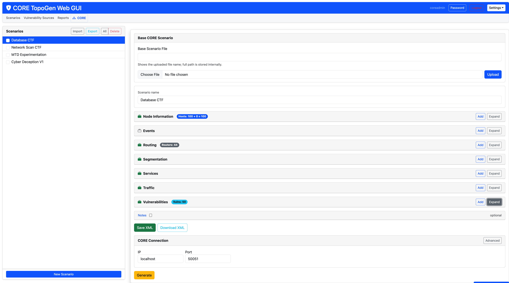
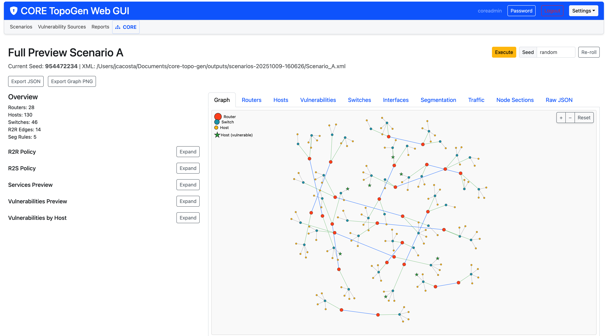

# CORE TopoGen Screenshots

Preview the major pages of the Web UI to get a feel for the workflow before running the app.

	
	
<em>Scenario dashboard with Full Preview summary, seed badge, and log dock.</em>

	
	
<em>Logs tab showing level/filter controls and the Follow toggle.</em>

	
	
<em>Full Preview modal: counts, segmentation summary, graph layout, and quick actions.</em>

	
	
<em>CORE sessions page lists active sessions, available topologies, and safe actions.</em>

	
	
<em>Reports page summarises recent runs with quick filters and Markdown download links.</em>

